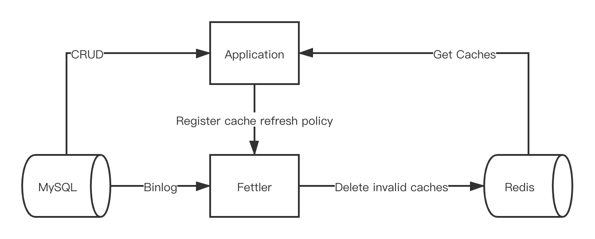

# Fettler

[](https://pypi.python.org/pypi/fettler)
[](https://github.com/long2ice/fettler)
[](https://github.com/long2ice/fettler/actions/workflows/pypi.yml)
[](https://github.com/long2ice/fettler/actions/workflows/ci.yml)

## Introduction

`Fettler` is a service that help you refresh redis cache automatically. By listening on MySQL binlog, you can refresh
redis cache in a timely manner and devoid of sensation or consciousness.



## Install

Just install from pypi:

```shell
> pip install fettler
```

## Usage

### Config file

The example can be found in [config.yml](./config.yml).

### Run services

First you should run the services, which include `producer`, `consumer`.

#### Use `docker-compose`(recommended)

```shell
docker-compose up -d --build
```

Then the services is running.

#### Run manual

##### Run producer

The producer listens on MySQL binlog and send data changes to redis message queue.

```shell
> fettler produce
```

##### Run consumer

The consumer consume message queue and delete invalid caches by data changes and refresh policy registered from server.

```shell
> fettler consume
```

## Register cache refresh policy

See [examples](./examples) to see how to add cache refresh policy in you application.

## License

This project is licensed under the [Apache-2.0](./LICENSE) License.
